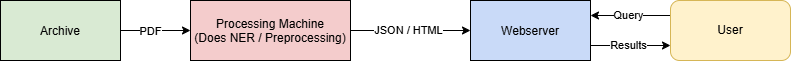

# Documentation

This document gives an overview of the AGNES system, and how to replicate the software for your own purposes. 

## Requirements and Installation

We first start by listing the requirements and how to install all the software. Be aware that 2 machines are needed: a webserver to hold the ElasticSearch index and serve the frontend, and a processing machine for doing the NER and pre-processing. See the below image for an overview of the intended workflow:

### Webserver
In most cases, this will be a VPS hosted through a hosting company, but if you have experience setting up a dedicated physical webserver, this will also work. It's also possible to run the webserver locally on a machine and not make it publicly accessible.
	
#### Requirements
Depends to some extent on the size of the index; the number of documents you are indexing. The requirements below will need to be scaled up depending on your corpus.

Minimal:
- 2 (v)CPU cores
- 2GB (v)RAM
- 200GB storage (mainly for HTML previews, see section below)
	
AGNES current specs, for 180.000 documents:
- 6 vCPU cores
- 8GB vRAM
- 2TB storage

#### Installation
- Install OS (developed on CentOS, should work on any Linux flavour. Windows is untested: here be dragons)
- Install Apache and set up a domain and host
- Install PHP
- Install Python3
- Install ElasticSearch, version 7.14 (or higher, but tested on 7.14)
- Run `sudo service elasticsearch start` to start ElasticSearch
- Install elasticsearch-php (https://github.com/elastic/elasticsearch-php)
- Create an index in ElasticSearch using `curl -X PUT "localhost:9200/YOUR-INDEX-NAME-HERE1?pretty"`
- Open file `/webserver-files/create-mapping.txt`, edit the index name (`YOUR-INDEX-NAME-HERE`) at the bottom to match your chosen index name, then copy and run the command on your webserver
- Copy files from `/webserver-files/html/` to the html folder for your domain
- Edit the file index.php; update the logo, text, design, etc, to match your own project
- Create a folder to hold the HTML versions of the documents, to load as page previews. This folder can get pretty big pretty fast, in our case we put this folder in a separate big storage drive added to the VPS. Make sure to set the permissions and owner of this folder so Apache can access it and serve it to users.
- Create a folder to hold the JSON that the Processing Machine creates. This folder should not be publicly accessible. Also create a folder to hold the JSON that has been indexed. The default folders for this are `/home/USERNAME/json_to_be_imported` and `/home/USERNAME/json_has_been_imported`. Also create a folder at `/home/USERNAME/json_import_logs` to hold the import logs.
- Copy `/webserver-files/upload-json-to-elasticsearch.py` to a (non public / non www) folder somewhere on your webserver. Open the file, and edit the JSON folder location and ElasticSearch index name at the top. 

			
### Processing Machine
This is the machine where the documents are harvested from the archives, and the NER is performed with BERT. This machine then produces HTML and JSON files, which are sent to the webserver for indexing. As BERT is quite demanding, a GPU is recommended for this machine, but BERT can also run on CPU, just significantly slower. This might still be an option if you have a small number of files and/or a lot of time to process the documents.
	
#### Requirements
Requirements are flexible, and not fully tested. At a minimum, you will need:

- Your preferred flavour of Linux
- 32GB or RAM
- A decent processor, doesn't have to be latest/fastest
- About 1 TB diskspace, largely dependent on the number of documents you are indexing
- A GPU that can handle the ArcheoBERTje-NER model, probably most will work, but this is not tested

AGNES processing machine current specs:
- Ubuntu 22.04.5 LTS Desktop
- 64GB RAM
- Intel i9-14900K
- NVIDIDA GeForce RTX 4090
	
#### Installation

- Install OS (developed on Ubuntu, should work on any Linux flavour. Windows is untested: here be dragons)
- Install Conda or Anaconda
- Create a new Conda environment, choose Python3.7 
- Activate the environment
- Clone or download this repository, navigate to the repository folder
- Install the requirements by running `pip install -r requirements.txt`

#### Configuration

Open the configuration file: `config.yaml`. This file contains all the settings and configuration you need to process and index documents. It contains 3 sections:

- `webserver`: this contains all the settings to connect to the webserver. Make sure to set the correct IP address, ssh port, ssh username, and the path to the HTML and JSON folders on your webserver. 
- `bert_models`: for each language you want to index, set the path to the corresponding BERT NER model. The Dutch/German/English BERT NER models can be found at: https://huggingface.co/alexbrandsen (be sure to download the NER model variants)
- `data_source`: here you can define various settings for the data source(s) and archive(s) you want to harvest from. At a minimum, you will need to set the html_folder, json_folder, pdf_folder and language, the other options are optional and depend on where you are getting your data from. An online archive will probably need an endpoint URL and a last_indexed_date or last_indexed_id to keep track of what has been harvested already. Make sure to make this match to what you retrieve your file-source-import scripts.  

We defined the ssh IP and username in the config file, but you will also need to create an ssh key for the webserver to be able to connect. Instructions differ for each OS, so this is outside the scope of this documentation, but here are the instructions for Ubuntu: https://help.ubuntu.com/community/SSH/OpenSSH/Keys. Once the ssh key is set up, the file import scripts should be able to transfer JSON and HTML to the webserver automatically.

#### Cron Setup

To make the harvesting and indexing run automatically at a set interval, you need to set up Cron. If not installed yet, first install Cron. Then follow these steps:
	
- Copy Conda section from ~/.bashrc to a new file called ~/.bashrc_conda
- Add the following 2 lines to cron using 'crontab -e':
	- SHELL=/bin/bash
	- BASH_ENV=~/.bashrc_conda
- Now add a cron line for each source you want to import, below example runs on midnight on Sunday, every week:
	- 0 0 * * 0 cd /path/to/source/; conda activate your_env; python3 /path/to/source/import.py; conda deactivate
		